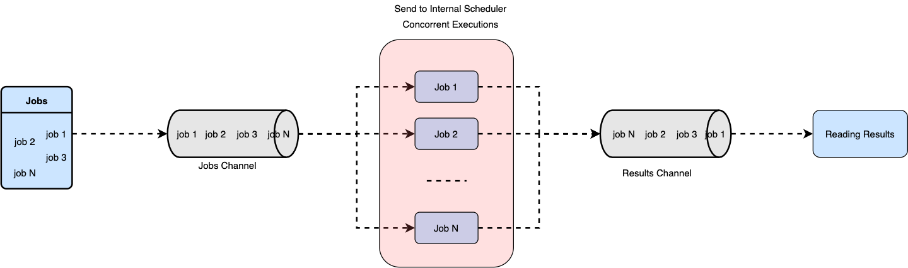

# SSH Conn Automator

Projeto básico para testar conexão remota via SSH em instâncias (porta 22 por padrão) ou aplicar um script em Shell.

O programa foi construído com o intuito de aplicar o padrão de concorrência de Golang chamado Worker Pools.

Abaixo uma representação de como funciona essa boa prática de concorrência:



## Build and Run

`cd ssh_automator`

`#GOOS=linux GOARCH=amd64 go build -o build/vulsPatch_0.1.4_linux_amd64 cmd/main.go`

`go run cmd/main.go`

## Usage

```
Usage:
  -f string
    	Arquivo com os endereços IP (default "example.txt")
  -o string
    	Operacao que o programa ira fazer (default "test | patch")
  -s string
    	Caminho do script caso queira plicar patch (default "script.sh")
```